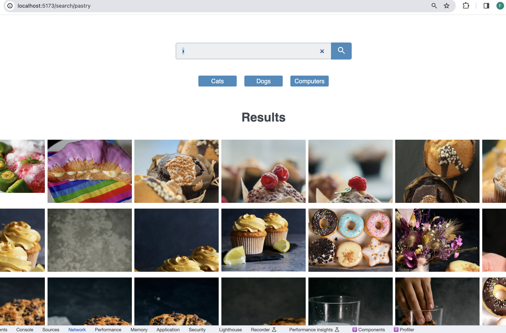

# React Gallery Search App
This project is part of Treehouse's Full Stack JavaScript Techdegree.
Find out more [here](https://teamtreehouse.com/home)

## Features 
- Search Bar
- Buttons for preselected queries
- Flickr API used to bring in data
- Ability to go back or forward through query history

## Tech Stack

   

